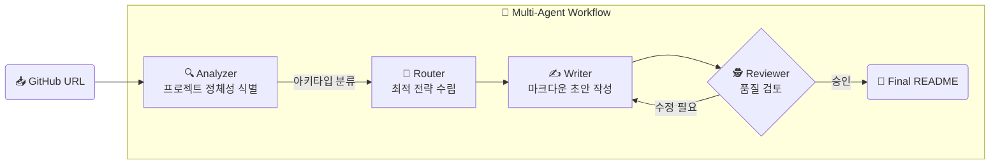
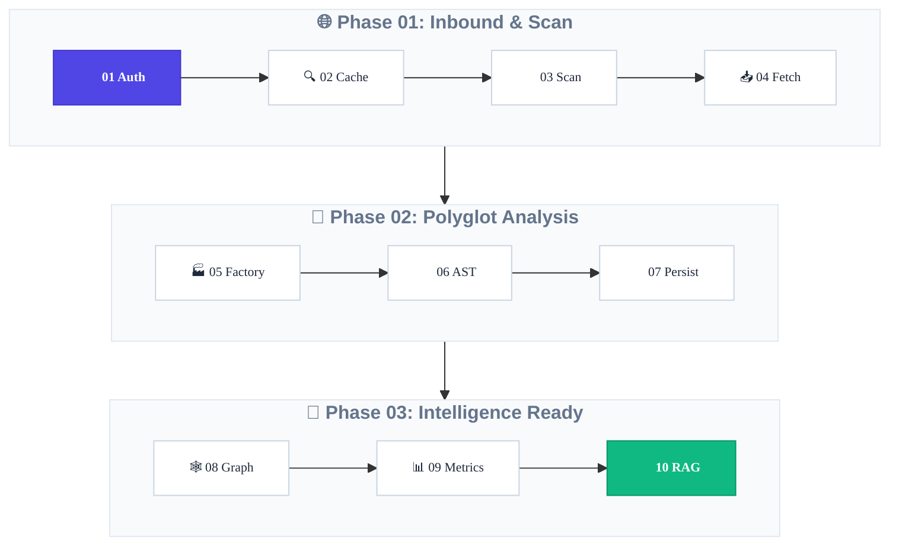

<div align="center">


# ChatFolio

**AI 기반 지능형 레포지토리 분석 · 자동 문서화 플랫폼**

GitHub URL 하나로 코드 의존성을 시각화하고, AI와 대화하며, 고품질 README를 자동 생성합니다.

<br/>

[](https://github.com/EJ-pro/ChatFolio)
[](https://react.dev)
[](https://fastapi.tiangolo.com)
[](https://langchain-ai.github.io/langgraph)
[](LICENSE)

<br/>

[**🚀 시작하기**](#-시작하기-getting-started) · [**✨ 주요 기능**](#-주요-기능) · [**⚙️ 핵심 아키텍처**](#%EF%B8%8F-핵심-아키텍처) · [**📂 폴더 구조**](#-폴더-구조)

</div>

---

## 💡 프로젝트 소개

새로운 오픈소스에 합류하거나 방대한 레거시 코드를 인계받을 때, 코드 파악에 드는 비용은 상상 이상입니다.

**ChatFolio**는 이 문제를 해결합니다. GitHub URL 하나만 입력하면:

- 📊 수천 개의 파일 간 **의존성 그래프**를 자동 추출
- 🤖 추출된 그래프를 기반으로 **AI 코드 챗봇**과 즉시 대화
- 📝 프로젝트 정체성을 분석해 **고품질 README**를 멀티 에이전트가 자동 작성

---

## ✨ 주요 기능

<table>
  <tr>
    <td width="50%">
      <h3>🕸 아키텍처 시각화</h3>
      <p><code>NetworkX</code>로 분석된 파일 간 의존성을 물리 시뮬레이션 기반 <code>react-force-graph</code>로 인터랙티브하게 렌더링합니다. 노드 크기로 핵심 파일을 즉시 파악할 수 있습니다.</p>
    </td>
    <td width="50%">
      <h3>💬 AI 코드 챗봇 (RAG)</h3>
      <p>의존성 그래프와 벡터 검색을 결합한 <strong>Hybrid RAG</strong>로 "이 클래스는 어디서 호출돼?"처럼 코드베이스에 대해 자연어로 질문하고 즉시 답변을 받습니다.</p>
    </td>
  </tr>
  <tr>
    <td width="50%">
      <h3>📄 AI Auto-Docs</h3>
      <p>단순 GPT 호출이 아닙니다. <strong>Analyzer → Router → Writer → Reviewer</strong>의 4단계 멀티 에이전트가 프로젝트를 스스로 이해하고 인간 수준의 README를 작성합니다.</p>
    </td>
    <td width="50%">
      <h3>🔀 Hybrid LLM 엔진</h3>
      <p>속도 중심의 <strong>Groq (Llama 3.3)</strong>와 품질 중심의 <strong>OpenAI (GPT-4o)</strong>를 탭 내에서 자유롭게 전환합니다. API 오류 시 폴백 모델로 자동 전환됩니다.</p>
    </td>
  </tr>
</table>

---

## ⚙️ 핵심 아키텍처

### 1. AI Auto-Docs Multi-Agent Pipeline

ChatFolio의 문서화 엔진은 LangGraph로 구성된 4단계 자율 에이전트 시스템입니다.



|   에이전트   | 역할                                                                                 |
| :----------: | ------------------------------------------------------------------------------------ |
| **Analyzer** | 설정 파일 및 언어 분포를 스캔하여 프로젝트 아키타입(Backend / Mobile / ML 등)을 식별 |
|  **Router**  | 식별된 아키타입에 따라 강조할 기술 스택과 섹션 구성을 결정                           |
|  **Writer**  | 의존성 그래프의 핵심 파일 스니펫을 바탕으로 마크다운 초안 작성                       |
| **Reviewer** | Getting Started 유효성, 기술적 정확도를 검토하고 Writer에 피드백 루프 실행           |

<br/>

### 2. Dynamic Identity Inference (지능형 프로젝트 식별)

URL 수집 단계부터 프로젝트의 정체성을 동적으로 파악합니다.

```
GitHub Repository
      │
      ├─ 📋 Manifest Discovery   ← package.json / build.gradle / requirements.txt 우선 탐색
      │                              → "이건 Android 프로젝트구나"
      │
      ├─ 📊 Graph Centrality     ← NetworkX In-degree 분석
      │                              → 가장 많이 참조된 파일 = 프로젝트 심장부
      │
      └─ 🔤 Language Weighting   ← 전체 파일 확장자 분포 계산
                                     → .kt 90% → Kotlin 특화 분석 가이드 전달
```

---

### 3. Data Collection Pipeline (10 Steps)

GitHub URL이 입력되는 순간부터 RAG 엔진이 준비될 때까지의 전 과정이 고도로 최적화된 자율 파이프라인으로 실행됩니다.



<br/>

### 4. Multi-Language Parser Support

`Factory Pattern` 기반의 파서 라우터가 파일 확장자를 감지하여 최적의 분석기를 자동으로 배정합니다.

#### 🔤 Language Parsers (`core/parser/lang/`)

|            언어             |        파서        | 주요 추출 항목                            |
| :-------------------------: | :----------------: | ----------------------------------------- |
|         **Python**          |   `ts_python.py`   | `class`, `def`, `import`, `from`          |
| **JavaScript / TypeScript** | `ts_javascript.py` | `function`, `const`, `import`, `export`   |
|          **Java**           |    `ts_java.py`    | `class`, `interface`, `method`, `package` |
|         **Kotlin**          |   `ts_kotlin.py`   | `class`, `fun`, `object`, `import`        |
|           **Go**            |     `ts_go.py`     | `func`, `struct`, `package`, `import`     |
|           **C++**           |    `ts_cpp.py`     | `class`, `function`, `#include`           |
|           **C#**            |   `ts_csharp.py`   | `class`, `namespace`, `using`             |
|          **Rust**           |    `ts_rust.py`    | `fn`, `struct`, `mod`, `use`              |
|          **Swift**          |   `ts_swift.py`    | `class`, `struct`, `func`, `import`       |
|          **Dart**           |    `ts_dart.py`    | `class`, `void`, `import`                 |
|           **PHP**           |    `ts_php.py`     | `class`, `function`, `namespace`, `use`   |
|          **Ruby**           |    `ts_ruby.py`    | `class`, `def`, `module`, `require`       |

#### ⚙️ Config Parsers (`core/parser/config/`)

|    형식    |        파서        | 용도                                     |
| :--------: | :----------------: | ---------------------------------------- |
| **Gradle** | `gradle_parser.py` | Android / Spring 의존성, 빌드 설정 추출  |
|  **JSON**  |  `json_parser.py`  | `package.json` 등 패키지 메타데이터 파싱 |
|  **YAML**  |  `yaml_parser.py`  | Docker Compose, CI/CD 설정 추출          |
|  **XML**   |  `xml_parser.py`   | `pom.xml`, `AndroidManifest.xml` 파싱    |
|  **SQL**   |  `sql_parser.py`   | DB 스키마 및 테이블 구조 추출            |

> 지원되지 않는 확장자는 기본 메타데이터 추출기(Fallback)로 처리되어 분석이 중단되지 않습니다.

---

## 🛠 기술 스택

<table>
  <tr>
    <th>영역</th>
    <th>기술</th>
  </tr>
  <tr>
    <td><strong>Frontend</strong></td>
    <td>
      React 18 (Vite) · Vanilla CSS · Zustand<br/>
      react-force-graph-2d · react-markdown · Lucide React
    </td>
  </tr>
  <tr>
    <td><strong>Backend</strong></td>
    <td>
      FastAPI (Python 3.10+) · LangGraph · LangChain<br/>
      OpenAI GPT-4o · Groq Llama 3.3 · NetworkX
    </td>
  </tr>
  <tr>
    <td><strong>Database</strong></td>
    <td>PostgreSQL · SQLAlchemy ORM</td>
  </tr>
  <tr>
    <td><strong>Infra</strong></td>
    <td>Docker · Docker Compose</td>
  </tr>
</table>

---

## 🚀 시작하기 (Getting Started)

### Prerequisites

- Docker & Docker Compose
- OpenAI API Key
- Groq API Key _(선택, 무료 티어 제공)_

### Installation

```bash
# 1. 저장소 클론
git clone https://github.com/EJ-pro/ChatFolio.git
cd ChatFolio

# 2. 환경 변수 설정
cp .env.sample .env
# .env 파일을 열어 API Key를 입력합니다

# 3. 실행
docker-compose up --build
```

> ✅ 실행 후 브라우저에서 `http://localhost` 로 접속하세요.

---

## 📂 폴더 구조

```
ChatFolio/
├── backend/
│   ├── core/
│   │   ├── rag/            # ChatFolioEngine, ReadmeAgent (Multi-Agent)
│   │   ├── parser/         # GitHub Fetcher, AST 파서 (다국어 지원)
│   │   └── graph/          # NetworkX 기반 의존성 그래프 빌더
│   ├── database/           # PostgreSQL 세션 및 ORM 모델
│   ├── models/             # Pydantic 스키마
│   └── main.py             # FastAPI 엔드포인트
├── frontend/
│   └── src/
│       ├── pages/          # Analysis, Chat, DocsTab, DocPipeline
│       ├── components/     # 레이아웃, 공통 UI
│       └── store/          # Zustand 전역 상태
├── .env.sample
└── docker-compose.yml
```

---

<div align="center">

**EJ-pro** · [GitHub](https://github.com/EJ-pro/ChatFolio)

_ChatFolio — 코드를 읽는 시간을, 만드는 시간으로._

</div>
