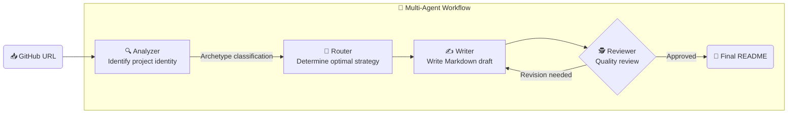

<div align="center">

```
            ██████╗██╗  ██╗ █████╗ ████████╗███████╗ ██████╗ ██╗     ██╗ ██████╗
            ██╔════╝██║  ██║██╔══██╗╚══██╔══╝██╔════╝██╔═══██╗██║     ██║██╔═══██╗
            ██║     ███████║███████║   ██║   █████╗  ██║   ██║██║     ██║██║   ██║
            ██║     ██╔══██║██╔══██║   ██║   ██╔══╝  ██║   ██║██║     ██║██║   ██║
            ╚██████╗██║  ██║██║  ██║   ██║   ██║     ╚██████╔╝███████╗██║╚██████╔╝
            ╚═════╝╚═╝  ╚═╝╚═╝  ╚═╝   ╚═╝   ╚═╝      ╚═════╝ ╚══════╝╚═╝ ╚═════╝
```

**AI-Powered Intelligent Repository Analysis & Automated Documentation Platform**

Visualize code dependencies, chat with AI, and auto-generate high-quality READMEs — all from a single GitHub URL.

<br/>

[](https://github.com/EJ-pro/ChatFolio)
[](https://react.dev)
[](https://fastapi.tiangolo.com)
[](https://langchain-ai.github.io/langgraph)
[](LICENSE)

<br/>

[**🚀 Getting Started**](#-getting-started) · [**✨ Key Features**](#-key-features) · [**⚙️ Core Architecture**](#%EF%B8%8F-core-architecture) · [**📂 Folder Structure**](#-folder-structure)

</div>

---

## 💡 Project Overview

When joining a new open-source project or taking over a large legacy codebase, the cost of understanding the code is immense.

**ChatFolio** solves this problem. Simply enter a GitHub URL to:

- 📊 Automatically extract **dependency graphs** across thousands of files
- 🤖 Instantly chat with an **AI code chatbot** powered by the extracted graph
- 📝 Analyze the project's identity and let a multi-agent system automatically write a **high-quality README**

---

## 🚀 Recent Updates (v1.1.0)

- **🌐 Multilingual Support**: The UI has been fully translated to English, and analysis and documentation can now be generated in both Korean and English.
- **👤 User-Customized Profile**: Provides optimized technical analysis and persona reports based on the user's country and job title.
- **🏗️ AI Architecture Analysis**: Analyzes the project's dependency graph to automatically generate professional reports covering design patterns, component roles, and data flow.
- **⚡ Performance Optimization (Caching Engine)**: Reduced reliance on real-time GitHub API calls and built a DB caching layer, improving profile page load speed by up to 10x.
- **📝 Multilingual README (KR/EN)**: Choose Korean, English, or generate a README supporting both languages simultaneously.

---

## ✨ Key Features

<table>
  <tr>
    <td width="50%">
      <h3>🕸 Architecture Visualization</h3>
      <p>Renders file-to-file dependencies analyzed by <code>NetworkX</code> interactively using physics-simulation-based <code>react-force-graph</code>. Node size instantly identifies core files.</p>
    </td>
    <td width="50%">
      <h3>💬 Intelligent Multilingual Chatbot</h3>
      <p>Ask questions about your code by combining dependency graphs with hybrid RAG. Receive real-time answers in your configured language (Korean or English).</p>
    </td>
  </tr>
  <tr>
    <td width="50%">
      <h3>📄 Global Auto-Docs</h3>
      <p>Generates high-quality, multi-language READMEs that reflect the actual project structure — not just a simple translation. Select multiple locales to build multilingual documentation simultaneously.</p>
    </td>
    <td width="50%">
      <h3>🔀 Hybrid LLM Engine</h3>
      <p>Freely switch between speed-focused <strong>Groq (Llama 3.3)</strong> and quality-focused <strong>OpenAI (GPT-4o)</strong> within the tab. Automatically falls back to an alternative model on API errors.</p>
    </td>
  </tr>
</table>

---

## ⚙️ Core Architecture

### 1. AI Auto-Docs Multi-Agent Pipeline

ChatFolio's documentation engine is a 4-stage autonomous agent system built with LangGraph.



|   Agent      | Role                                                                                          |
| :----------: | --------------------------------------------------------------------------------------------- |
| **Analyzer** | Scans config files and language distribution to identify the project archetype (Backend / Mobile / ML, etc.) |
| **Router**   | Based on the identified archetype, decides which tech stack and sections to emphasize         |
| **Writer**   | Writes a Markdown draft using core file snippets from the dependency graph                    |
| **Reviewer** | Reviews Getting Started validity and technical accuracy, then runs a feedback loop to Writer  |

<br/>

### 2. Dynamic Identity Inference

Dynamically infers the project's identity starting from the URL collection stage.

```
GitHub Repository
      │
      ├─ 📋 Manifest Discovery   ← Prioritizes package.json / build.gradle / requirements.txt
      │                              → "This is an Android project"
      │
      ├─ 📊 Graph Centrality     ← NetworkX In-degree analysis
      │                              → Most-referenced file = project's core
      │
      └─ 🔤 Language Weighting   ← Calculate full file extension distribution
                                     → .kt 90% → Deliver Kotlin-specialized analysis guide
```

---

### 3. Data Collection Pipeline (10 Steps)

From the moment a GitHub URL is entered until the RAG engine is ready, 10 pipeline stages execute.

```
 Step 01  🔐 Auth            Validate user PAT, check Rate Limit
    ↓
 Step 02  🔍 Cache Check     Check latest commit SHA via GitHub API → reuse cache or re-analyze
    ↓
 Step 03  📡 Scan            Recursive directory traversal, filter .gitignore and binary files
    ↓
 Step 04  📥 Fetch           Load large files without OOM via Python Generator streaming
    ↓
 Step 05  🏭 Parser Factory  Dynamically match optimal language parser by extension (Polyglot support)
    ↓
 Step 06  🌳 AST Parse       Extract and normalize classes, functions, and import statements per language
    ↓
 Step 07  💾 Persist         Save parsed results + original code in a PostgreSQL transaction
    ↓
 Step 08  🕸 Graph Build     Map import paths to actual files via Resolver Factory, build NetworkX DiGraph
    ↓
 Step 09  📊 Metrics         Identify core files via node degree calculation, convert to frontend JSON
    ↓
 Step 10  🤖 RAG Engine      Load analysis data into ChatFolioEngine, complete vector embeddings → ready for chat
```

<br/>

### 4. Multi-Language Parser Support

A `Factory Pattern`-based parser router detects the file extension and automatically assigns the optimal analyzer.

#### 🔤 Language Parsers (`core/parser/lang/`)

|            Language             |        Parser        | Key Extracted Items                       |
| :-----------------------------: | :------------------: | ----------------------------------------- |
|         **Python**              |   `ts_python.py`     | `class`, `def`, `import`, `from`          |
| **JavaScript / TypeScript**     | `ts_javascript.py`   | `function`, `const`, `import`, `export`   |
|          **Java**               |    `ts_java.py`      | `class`, `interface`, `method`, `package` |
|         **Kotlin**              |   `ts_kotlin.py`     | `class`, `fun`, `object`, `import`        |
|           **Go**                |     `ts_go.py`       | `func`, `struct`, `package`, `import`     |
|           **C++**               |    `ts_cpp.py`       | `class`, `function`, `#include`           |
|           **C#**                |   `ts_csharp.py`     | `class`, `namespace`, `using`             |
|          **Rust**               |    `ts_rust.py`      | `fn`, `struct`, `mod`, `use`              |
|          **Swift**              |   `ts_swift.py`      | `class`, `struct`, `func`, `import`       |
|          **Dart**               |    `ts_dart.py`      | `class`, `void`, `import`                 |
|           **PHP**               |    `ts_php.py`       | `class`, `function`, `namespace`, `use`   |
|          **Ruby**               |    `ts_ruby.py`      | `class`, `def`, `module`, `require`       |

#### ⚙️ Config Parsers (`core/parser/config/`)

|    Format    |        Parser        | Purpose                                        |
| :----------: | :------------------: | ---------------------------------------------- |
| **Gradle**   | `gradle_parser.py`   | Extract Android / Spring dependencies and build config |
|  **JSON**    |  `json_parser.py`    | Parse package metadata such as `package.json`  |
|  **YAML**    |  `yaml_parser.py`    | Extract Docker Compose and CI/CD configuration |
|  **XML**     |  `xml_parser.py`     | Parse `pom.xml`, `AndroidManifest.xml`         |
|  **SQL**     |  `sql_parser.py`     | Extract DB schema and table structure          |

> Unsupported extensions are handled by the default metadata extractor (Fallback), so analysis is never interrupted.

---

## 🛠 Tech Stack

<table>
  <tr>
    <th>Layer</th>
    <th>Technology</th>
  </tr>
  <tr>
    <td><strong>Frontend</strong></td>
    <td>
      React 18 (Vite) · Vanilla CSS · Zustand<br/>
      react-force-graph-2d · react-markdown · Lucide React
    </td>
  </tr>
  <tr>
    <td><strong>Backend</strong></td>
    <td>
      FastAPI (Python 3.10+) · LangGraph · LangChain<br/>
      OpenAI GPT-4o · Groq Llama 3.3 · NetworkX
    </td>
  </tr>
  <tr>
    <td><strong>Database</strong></td>
    <td>PostgreSQL · SQLAlchemy ORM</td>
  </tr>
  <tr>
    <td><strong>Infra</strong></td>
    <td>Docker · Docker Compose</td>
  </tr>
</table>

---

## 🚀 Getting Started

### Prerequisites

- Docker & Docker Compose
- OpenAI API Key
- Groq API Key _(optional, free tier available)_

### Installation

```bash
# 1. Clone the repository
git clone https://github.com/EJ-pro/ChatFolio.git
cd ChatFolio

# 2. Set up environment variables
cp .env.sample .env
# Open .env and enter your API keys

# 3. Run
docker-compose up --build
```

> ✅ After starting, open your browser and go to `http://localhost`.

---

## 📂 Folder Structure

```
ChatFolio/
├── backend/
│   ├── core/
│   │   ├── rag/            # ChatFolioEngine, ReadmeAgent (Multi-Agent)
│   │   ├── parser/         # GitHub Fetcher, AST parsers (multilingual support)
│   │   └── graph/          # NetworkX-based dependency graph builder
│   ├── database/           # PostgreSQL session and ORM models
│   ├── models/             # Pydantic schemas
│   └── main.py             # FastAPI endpoints
├── frontend/
│   └── src/
│       ├── pages/          # Analysis, Chat, DocsTab, DocPipeline
│       ├── components/     # Layout and shared UI components
│       └── store/          # Zustand global state
├── .env.sample
└── docker-compose.yml
```

---

<div align="center">

**EJ-pro** · [GitHub](https://github.com/EJ-pro/ChatFolio)

_ChatFolio — Turn the time you spend reading code into time spent creating._

</div>
