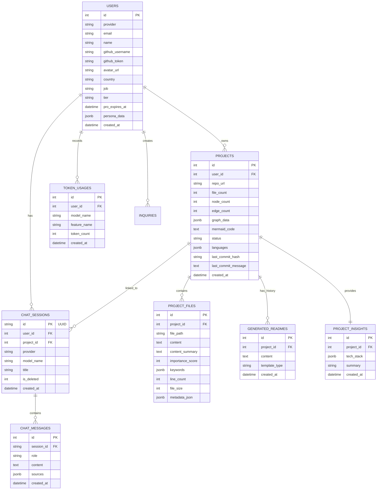

# ERD (Entity Relationship Diagram)

```mermaid
erDiagram
    USERS ||--o{ PROJECTS : owns
    USERS ||--o{ CHAT_SESSIONS : has
    USERS ||--o{ TOKEN_USAGES : records
    USERS ||--o{ INQUIRIES : creates

    PROJECTS ||--o{ PROJECT_FILES : contains
    PROJECTS ||--o{ GENERATED_READMES : has_history
    PROJECTS ||--o{ CHAT_SESSIONS : linked_to
    PROJECTS ||--|| PROJECT_INSIGHTS : provides

    CHAT_SESSIONS ||--o{ CHAT_MESSAGES : contains

    USERS {
        int id PK
        string provider
        string email
        string name
        string github_username
        string github_token
        string avatar_url
        string country
        string job
        string tier
        datetime pro_expires_at
        jsonb persona_data
        datetime created_at
    }

    PROJECTS {
        int id PK
        int user_id FK
        string repo_url
        int file_count
        int node_count
        int edge_count
        jsonb graph_data
        text mermaid_code
        string status
        jsonb languages
        string last_commit_hash
        text last_commit_message
        datetime created_at
    }

    PROJECT_FILES {
        int id PK
        int project_id FK
        string file_path
        text content
        text content_summary
        int importance_score
        jsonb keywords
        int line_count
        int file_size
        jsonb metadata_json
    }

    GENERATED_READMES {
        int id PK
        int project_id FK
        text content
        string template_type
        datetime created_at
    }

    PROJECT_INSIGHTS {
        int id PK
        int project_id FK
        jsonb tech_stack
        string summary
        datetime created_at
    }

    CHAT_SESSIONS {
        string id PK "UUID"
        int user_id FK
        int project_id FK
        string provider
        string model_name
        string title
        int is_deleted
        datetime created_at
    }

    CHAT_MESSAGES {
        int id PK
        string session_id FK
        string role
        text content
        jsonb sources
        datetime created_at
    }

    TOKEN_USAGES {
        int id PK
        int user_id FK
        string model_name
        string feature_name
        int token_count
        datetime created_at
    }
```
