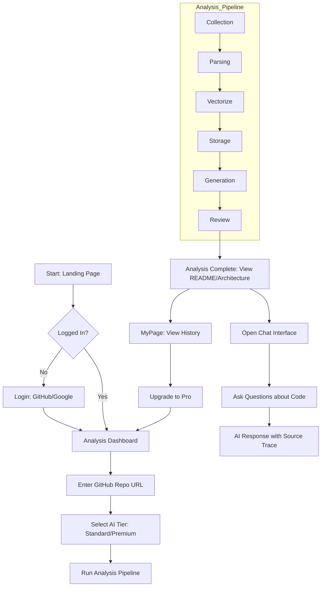

# User Flow (유저 플로우)

## 1. Main Journey

## 2. Subscription Flow
1. User clicks "Upgrade to Pro" in Header.
2. Confirmation Modal appears.
3. User confirms (Mock Payment).
4. Tier updated to 'pro' in DB.
5. All models (Groq/OpenAI) unlocked.
